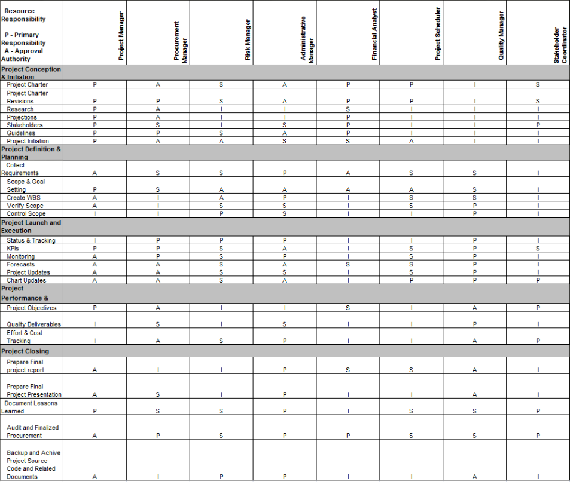
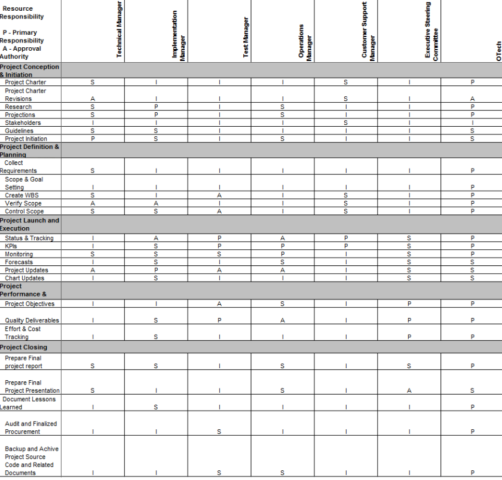

# PROJECT OVERVIEW

## B. PLANNING THE PROJECT

### Project Management Life Cycle
The Gantt Chart used to describe and document the project management life cycle enables QTMT personnel to sometimes adhere to the rules and reach the milestone. The project life cycle WBS divides each member's role and work into several modules, including the project manager's. Based on the created WBS, each member has their own duties and contributions to make at each point of the lifecycle.

The Gantt Chart below shows the project management WBS:

### Scope
To map all relevant activities and build the process, a work breakdown structure (WBS) is built. The WBS will be updated and approved.

Our research intends to create a chatbot for mental health that can comprehend and evaluate a person's mental health through natural language interaction. The chatbot will be able to help people identify and obtain the assistance they require in a discrete, private, and user-friendly manner after being educated on various mental health datasets. The goal is to develop a tool that can help in early detection, management, and treatment of mental health issues while also enhancing overall mental health outcomes. The chatbot will be created to respect user privacy and offer a secure forum for people to talk about their mental health issues.

### Risk Identification Chart (Quality, Cost, Time)

| Control Element | What is likely to go wrong? | How and when will I know? | What will I do about it? |
|-----|----|-------|-----|
|Quality   (A poor quality mindset, poor design, poor materials, poor craftsmanship, and a weak quality assurance programme)|
|Cost   (Errors in estimation; insufficient productivity, cost, change, or contingency)|
|Time   (Flawed allocation and management of float, early release of rival goods, flaws in forecasting time or resource availability, problems in identifying the critical route.)|

### Responsibility Assignment Matrices (RAM)

|Roles|
 Person In Charge 
|Responsibility|
|:-----:|:------:|------|
| Project Manager | Fatin Najdah | For all operations connected to project office administration, the project manager is answerable to the project director. The project manager aids in the creation of the master project schedule and all other project work plans, as well as develops, directs, and monitors daily internal operations that support the project office. The project manager for the Mental Health Chatbot Project will need to choose who we may approach with our concept and who is most likely to accept it. The project manager must also verify that all initiation and planning papers, including the Work Breakdown Structure (WBS) and Gantt chart, are created in an understandable and comprehensive manner.    The development, upkeep, and adherence to the Project Office infrastructure and supporting methodology (such as processes, procedures, standards, and templates) that are in accordance with OSI Best Practices and policies are the responsibility of the Project Manager. The Mental Health Chatbot Project must continue to be watched over to ensure that its progress is in line with its requirements and scope. If a problem arises, the project manager must work on a solution.|
| Procurement Manager | Naufal Fiqri | The RFP or RFO and other solicitation documents are created under the direction and management of the procurement manager. The procurement manager is in charge of integrating all the parts, guaranteeing consistency and continuity throughout the whole procurement process, and adhering to procurement standards, rules, and laws. Other departments of the project office may be given responsibility for particular portions. This involves organising contract negotiations, planning and monitoring the procurement calendar, supervising the production of the RFP or RFO, and managing the review of bids and offers as well as vendor selection.    The project's contract, rules, and timelines must be discussed with each participant by the procurement manager. Additionally, the procurement manager must make sure that no employee uses corporate funds to purchase any linked items. The procurement manager must authorise all expenses.|
| Risk Manager | Aina Syazzween | The project's risk management and tracking responsibilities fall within the purview of the risk manager. In order to guarantee that prime contractor risk management initiatives do not negatively affect the project, the risk manager also keeps an eye on them. The project's risk manager oversees risk identification sessions, monitors prime contractor risk management efforts, and takes part in division-level risk management activities for risks that cross project boundaries or are outside the scope of the project. The risk manager also manages and tracks potential and active risks, maintains the risk management tool and documentation information.    Every risk associated with this project must be listed. For instance, the team must identify the emotion in an image for the Mental Health Chatbot project. If the team randomly takes pictures of people without asking their permission, this session might be risky. As a result, the team will consider potential solutions to this challenge.    Unexpected issues might arise at any stage of this endeavour. Therefore, the risk management must record every danger so that they can prevent it and take precautions to ensure that specific issue won't arise.|
| Administrative Manager | Aina Syazzween | In charge of administration The Administrative Manager leads the cost management effort, including sponsoring cost budgeting and tracking activities, facilitating communication on financial status, and ensuring the project cost tool and supporting documentation is maintained. The Administrative Manager also directs the administrative staff, plans tool and service training, ensures that the administrative staff follows processes and policies, and supervises the administrative staff. Additionally, the administrative manager offers reports, suggestions, and updates on the project budget and expenditures, such as planned vs. actual reports, starts corrective action, and plans actions for re-planning.    The administrative manager of the Mental Health Chatbot project must make a list of everything that may be included in the documentation form following each step. For instance, the activity report and any cost-related documents. This position is crucial to reduce time and financial waste and to ensure that everyone and everything follows the documentation's standard operating procedure.|
| Financial Analyst | Naufal Fiqri | In order to assist the Administrative Manager, the Financial Analyst is in charge of managing and tracking the budget and costs for the Mental Health Chatbot project, coordinating and preparing budgetary documents, such as Special Project Reports and OSI Budget Change Proposals, reviewing budget and contract expenditures, and gathering and reporting financial metrics. This involves creating financial management rules and procedures as well as balancing the accounting and Work Breakdown Structure cost management processes.    Assisting in the examination of the cost and administrative portions of the proposals in accordance with the standards in the Evaluation Plan, the Financial Analyst also offers help in the project solicitations, evaluations, and award processes.    The primary responsibility of the financial analyst is to sift through data to find opportunities and assess the results for this Mental Health Chatbot project.|
| Project Scheduler | Aina Syazzween | The project scheduler's job is to coordinate and manage the inputs to the plan, which includes monitoring progress against the project schedule, merging and figuring out how the project schedule is dependent on other schedules, and monitoring progress on the schedule of the prime contractor and the schedules of the counties.    In order to prevent system development from spiralling out of control and to mitigate unforeseen risk brought on by delays or interruptions in the progress, the project scheduler's job is to design the progress flow and track it.|
| Quality Manager | Naufal Fiqri | The Mental Health Chatbot system, as well as the quality and the Prime Contractor, are under the control of the Quality Manager. The quality manager examines process and product activities for compliance with standards and plans, providing insight into the business practises of the project and contractor.    The quality manager is crucial to the success of our project since they must assess the system's overall quality and the end product in order for the system to effectively and precisely identify emotions without making dumb mistakes. Finally, the quality manager will perform a report on the quality standard issues for top management, such as the project manager, so that the project may be improved.|
| Stakeholder Coordinator | Fatin Najdah | To facilitate the effective deployment and continuous maintenance of the Mental Health Chatbot system, the Stakeholder Coordinator serves as the primary point of contact between the stakeholders and the Project Office.    The Coordinator addresses stakeholder-related issues and makes sure that they are resolved in a timely manner in addition to monitoring crucial continuing stakeholder communication. By creating and maintaining the section of the Issue and Escalation Process that pertains to the stakeholders, the Coordinator controls stakeholder issues. In meetings and reports, the stakeholder coordinator informs the impacted stakeholders of risks and challenges. Stakeholder coordinator works with project schedule to arrange stakeholder schedules for planning and implementation activities.    The sensitive information of a stakeholder must be secure at this position and only available to the project's essential personnel. The stakeholder coordinator must prioritise those who are significant to us and work to get their financial or other support for our project.|
| Technical Manager | Aina Syazzween | The day-to-day operations of state and vendor technical employees involved in the project's technical management are under the control of the technical manager. The technical manager and system engineer will share leadership in some of the project's technical disciplines but not all of them.    The role of the technical manager is to collaborate with other IT managers to get the necessary technical support for the new system's enterprise architecture, database, software development, security, testing, configuration management, change management, and release management. Throughout the project life cycle, the Technical Manager will work with the System Engineer to offer direction and support to technical staff that is added to the project.    In addition, the Technical Manager is responsible for establishing and carrying out technical policies, processes, and procedures for the Project Director, Project Manager, and other managers in the Project Office.|
| Implementation Manager | Naufal Fiqri | The Implementation Manager will be in charge of the project's implementation component and will provide leadership in terms of planning, organising, coordinating, and overseeing implementation activities. Along with managing the implementation strategy, organisational change management, production support, IT training, defect or problem tracking, and Maintenance & Operation, the Implementation Manager is also responsible for managing all information technology resources assigned by the Project Manager. To make sure that technical duties meet all goals and expectations, the implementation manager will organise SOWs and interact directly with contractors.    In order to establish a connection between the project leader and the system developer, the implementation manager's role in the emotion detection system project will resemble that of an intermediary. This includes transferring instructions from the manager and aiding in managing the developer's workload.|
| Test Manager | Fatin Najdah | The system testing for the Prime Contractor is coordinated by the Test Manager. The Manager collaborates with the Quality Management team to create test cases and data that will provide the system the most accurate representation of "real-life" circumstances. When necessary, the Test Manager must coordinate interface testing with other entities (county, state, and federal). The procedure for reporting problems and resolving them is planned, monitored, and evaluated for the primary contractor.    In this project, their responsibility will be to test the system and then report any problems to the developer so that the system may be improved. It is crucial for this assignment to avoid misunderstanding or accidents that may occur after it is released since in the worst case scenario, it may jeopardise the future of the entire development team.|
| Operations Manager | Aina Syazzween | The new system's activities must be coordinated and monitored by the operations manager. Any solutions to issues that arise over the course of the project must be approved by the operations manager. Operation Manager, for instance, has the authority to decide whether to upgrade the system's hardware or software when they are having trouble extracting emotion from an image. Additionally, the duties of the operation manager include administrative and operating tasks. The operation manager for the emotion detection project is in charge of making sure that everyone in the team is doing their task correctly.|
| Customer Support Manager | Naufal Fiqri | The Customer Support Manager is in charge of managing the M&O Contractor service initiatives and aiding the client with any unique needs or issues. The Customer Support Manager prioritises problems from the standpoint of the customer and keeps track of contractor service levels and KPIs.    The project's support manager will assist customers by responding to their questions and frequently asked questions via email, phone, and social media chat. This plays a crucial function in making the consumer feel welcomed and valued.|
| Executive Steering Committee | Fatin Najdah | In its capacity as the project's stakeholders, the Executive Steering Committee makes sure that the project's functionality and deliverables are met in accordance with the terms of the project initiation agreements and subsequent project management plans. In addition to receiving project progress reports, this committee also gives high-level project direction and addresses and resolves any problems, hazards, or modification requests.    The Executive Steering Committee also has to decide how we will handle the project's finances. He gauges progress in relation to the precise goals, benchmarks, and deliverables of each work page.|
| J Group Inc. Representative | Fatin Najdah | The J Group Inc. Representative serves as a point of contact between the Project Office and the J Group Inc. in order to define the services that are necessary, help the project determine whether certain services are feasible, provide cost estimates, plan ahead, and provide other technical support to help the project make knowledgeable data centre decisions.    This position is crucial since it will aid our business in deciding which technology and stack to prioritise. We can only examine the risk management and assessibility once the technological stack and requirements have been established. In order to ensure the proper technological stack and cost in a firm, J Group Inc. is crucial.|

   
##### Next: [Project Implementation](C-PROJECT_IMPLEMENTATION.md)
